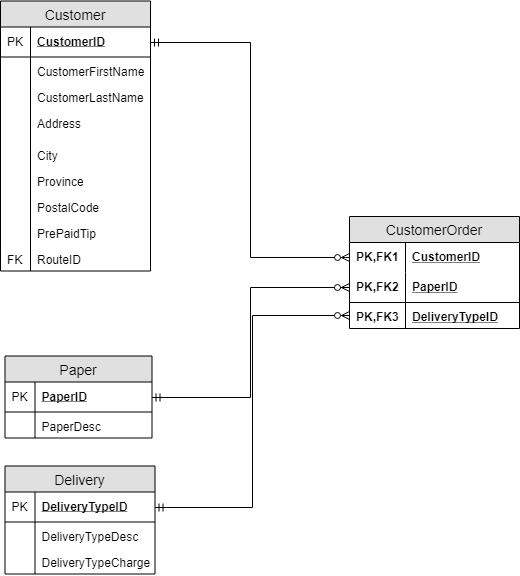
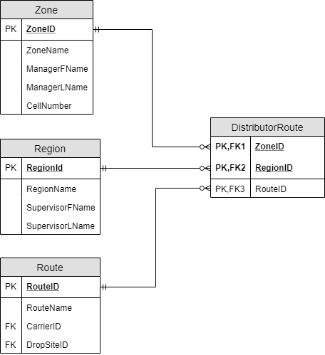
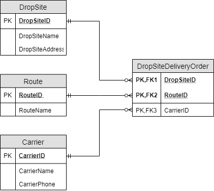
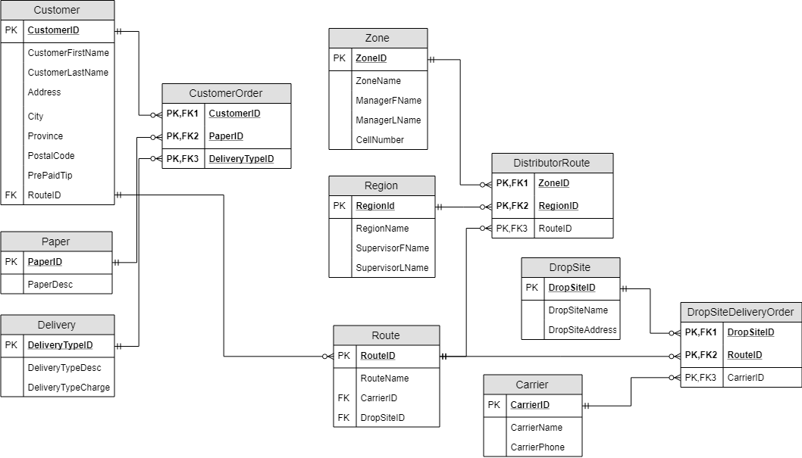

## News 2 GO!
## Newspaper distribution


## Customer Profile View

> *Description or Image*

### 0NF

**Customer** <span class='md'><b class='pk'>CustomerID</b>, CustomerFirstName, CustomerLastName,Address,City,Province,PostalCode, PrePaidTip, RouteID, RouteName, <b class='rg'>PaperID, PaperDesc, DeliveryTypeID, DeliveryTypeDesc, DeliveryTypeCharge </b> </span>
                             
### 1NF

**Customer** <span class='md'><b class='pk'>CustomerID</b>, CustomerFirstName, CustomerLastName,Address,City,Province,PostalCode, PrePaidTip, RouteID, RouteName </span>

**Paper** <span class='md'><b class='pk'>PaperID </b>, PaperDesc</span>

**Delivery** <span class='md'><b class='pk'>DeliveryTypeID </b>, DeliveryTypeDesc, DeliveryTypeCharge </span>

### 2NF

**Customer** <span class='md'><b class='pk'>CustomerID</b>, CustomerFirstName, CustomerLastName,Address,City,Province,PostalCode, PrePaidTip ,<i class='fk'> RouteID </i> </span>

**Route** <span class='md'><b class='pk'> RouteID</b>, RouteName </span>

**CustomerOrder** <span class='md'><b class='pk'><i class='fk'>CustomerID, PaperID </i></b>, DeliveryTypeID</span>

### 3NF

**CustomerOrder** <span class='md'><b class='pk'><i class='fk'>CustomerID, PaperID, DeliveryTypeID</i></b></span>

### Final Tables

**Customer** <span class='md'><b class='pk'>CustomerID</b>, CustomerFirstName, CustomerLastName,Address,City,Province,PostalCode, PrePaidTip ,<i class='fk'> RouteID </i> </span>

**Route** <span class='md'><b class='pk'> RouteID</b>, RouteName </span>

**Paper** <span class='md'><b class='pk'>PaperID </b>, PaperDesc</span>

**Delivery** <span class='md'><b class='pk'>DeliveryTypeID </b>, DeliveryTypeDesc, DeliveryTypeCharge </span>

**CustomerOrder** <span class='md'><b class='pk'><i class='fk'>CustomerID, PaperID, DeliveryTypeID</i></b></span>

### Customer Profile View ERD



----

##  Distributors Routes Summary View

> *About*

### 0NF

**Zone** <span class='md'><b class='pk'>ZoneID</b>, ZoneName, ManagerFName, ManagerLName, CellNumber, <b class='rg'> RegionId, RegionName, SupervisorFName, SupervisorLName, RouteID, RouteName, CarrierID, DropSiteID </b></span>

### 1NF

**Zone** <span class='md'><b class='pk'>ZoneID</b>, ZoneName, ManagerFName, ManagerLName, CellNumber</span>

**Region** <span class='md'><b class='pk'>RegionId</b> RegionName, SupervisorFName, SupervisorLName, RouteID, RouteName, CarrierID, DropSiteID </span>

### 2NF

**Zone** <span class='md'><b class='pk'>ZoneID</b>, ZoneName, ManagerFName, ManagerLName, CellNumber</span>

**Region** <span class='md'><b class='pk'>RegionId</b> RegionName, SupervisorFName, SupervisorLName</span>

**Route** <span class='md'><b class='pk'> RouteID</b>, RouteName, CarrierID, DropSiteID </span>

### 3NF

**Zone** <span class='md'><b class='pk'>ZoneID</b>, ZoneName, ManagerFName, ManagerLName, CellNumber</span>

**Region** <span class='md'><b class='pk'>RegionId</b> RegionName, SupervisorFName, SupervisorLName</span>

**Route** <span class='md'><b class='pk'> RouteID</b>, RouteName, CarrierID, DropSiteID </span>

**DistributorRoute** <span class='md'><b class='pk'> <i class='fk'>ZoneID, RegionID, RouteID</i></b></span>

### Final Tables

**Zone** <span class='md'><b class='pk'>ZoneID</b>, ZoneName, ManagerFName, ManagerLName, CellNumber</span>

**Region** <span class='md'><b class='pk'>RegionId</b> RegionName, SupervisorFName, SupervisorLName</span>

**Route** <span class='md'><b class='pk'> RouteID</b>, RouteName, CarrierID, DropSiteID </span>

**DistributorRoute** <span class='md'><b class='pk'> <i class='fk'>ZoneID, RegionID, RouteID</i></b></span>


### Distributors Routes Summary View ERD



-----
## Drop Site Delivery Orders View 

> *Description or Image*

### 0NF

**DropSite** <span class='md'><b class='pk'>DropSiteID</b>, DropSiteName, DropSiteAddress,<b class='rg'> RouteID, RouteName, CarrierID, CarrierName, CarrierPhone</b> </span>
                             
### 1NF
**DropSite** <span class='md'><b class='pk'>DropSiteID</b>, DropSiteName, DropSiteAddress </span>

**Route** <span class='md'><b class='pk'>RouteID </b>, RouteName </span>

**Carrier** <span class='md'><b class='pk'>CarrierID</b>, CarrierName, CarrierPhone </span>

### 2NF

No change.

### 3NF

**DropSiteDeliveryOrder** <span class='md'><b class='pk'> <i class='fk'>DropSiteID, RouteID, CarrierID </i></b></span>

### Final Tables

**DropSite** <span class='md'><b class='pk'>DropSiteID</b>, DropSiteName, DropSiteAddress </span>

**Route** <span class='md'><b class='pk'>RouteID </b>, RouteName </span>

**Carrier** <span class='md'><b class='pk'>CarrierID</b>, CarrierName, CarrierPhone </span>

**DropSiteDeliveryOrder** <span class='md'><b class='pk'> <i class='fk'>DropSiteID, RouteID, CarrierID </i></b></span>


### Drop Site Delivery Orders View  ERD



----

## News 2 GO!

## Merged ERD

**Customer** <span class='md'><b class='pk'>CustomerID</b>, CustomerFirstName, CustomerLastName,Address,City,Province,PostalCode, PrePaidTip ,<i class='fk'> RouteID </i> </span>

**Paper** <span class='md'><b class='pk'>PaperID </b>, PaperDesc</span>

**Delivery** <span class='md'><b class='pk'>DeliveryTypeID </b>, DeliveryTypeDesc, DeliveryTypeCharge </span>

**CustomerOrder** <span class='md'><b class='pk'><i class='fk'>CustomerID, PaperID, DeliveryTypeID</i></b></span>


**Zone** <span class='md'><b class='pk'>ZoneID</b>, ZoneName, ManagerFName, ManagerLName, CellNumber</span>

**Region** <span class='md'><b class='pk'>RegionId</b> RegionName, SupervisorFName, SupervisorLName</span>

**Route** <span class='md'><b class='pk'> RouteID</b>, RouteName, CarrierID, DropSiteID </span>

**DistributorRoute** <span class='md'><b class='pk'> <i class='fk'>ZoneID, RegionID, RouteID</i></b></span>


**DropSite** <span class='md'><b class='pk'>DropSiteID</b>, DropSiteName, DropSiteAddress </span>

**Carrier** <span class='md'><b class='pk'>CarrierID</b>, CarrierName, CarrierPhone </span>

**DropSiteDeliveryOrder** <span class='md'><b class='pk'> <i class='fk'>DropSiteID, RouteID, CarrierID </i></b></span>

### News 2 GO! ERD




## Legend

This legend is a guide to reading and interpreting the table listings under 0NF through 3NF.

- **TableName:**
  - Table names will be bolded and end with a colon. (e.g.: `**TableName:**`)
- (Column, Names)
  - Column names for a table will be enclosed in (rounded parenthesis) (e.g.: `<span class="md">All, Attributes</span>`).
- <b class="pk">PrimaryKeyFields</b>
  - Primary key fields will be bold and inside a box. (e.g.: `<b class="pk">PrimaryKeyFields</b>`)
- <u class="fk">ForeignKeyFields</u>
  - Foreign key fields will be a wavy underline in italic and green. (e.g.: `<u class="fk">ForeignKeyFields</u>`)
- <b class="rg">Repeating Groups</b>
  - Groups of repeating fields will be identified in 0NF stage, and will be enclosed in orange curly braces. (e.g.: `<b class="rg">Repeating, Group, Fields</b>`)

----

## Styling

Most of the styling is done by the default conversion from Markdown (.md) to Markup (.html). Additional styling for primary keys, foreign keys, and notes are made through the following stylesheet. <span class="note">Note:</span> Mardown text can include regular HTML elements, but not all elements are rendered on GitHub.com by default (such as the `<style>` and `<script>` elements).

```html
<style type="text/css">
.md {
    display: inline-block;
    vertical-align: top;
    white-space:normal;
}
.md::before {
    content: '(';
    font-size: 1.25em;
    font-weight: bold;
}
.md::after {
    content: ')';
    font-size: 1.25em;
    font-weight: bold;
}
.pk {
    font-weight: 700;
    display: inline-block;
    border: thin solid #00f;
    padding: 0 2px;
    position: relative;
}
.pk::before {
    content: 'P';
    font-size:.55em;
    font-weight: bold;
    color: white;
    background-color: #72c4f7;
    position: absolute;
    left: -5px;
    top: -15px;
    border-radius: 50%;
    border: solid thin blue;
    width: 1.4em;
    height: 1.4em;
    padding:3px;
    text-align:center;
}
.fk {
    color: green;
    font-style: italic;
    text-decoration: wavy underline green;
    padding: 0 2px;
    position: relative;
}
.fk::before {
    content: 'F';
    font-size:.65em;
    position: absolute;
    left: -1px;
    bottom: -17px;
    color:darkgreen;
    background-color: #a7dea7;
    border-radius: 50%;
    border: dashed thin green;
    width: 1.4em;
    height: 1.4em;
    padding:3px;
    text-align:center;
}
.rg::before {
    content: '\007B';
    color: darkorange;
    font-size: 1.2em;
    font-weight: bold;
}
.rg::after {
    content: '\007D';
    color: darkorange;
    font-size: 1.2em;
    font-weight: bold;
}
.rg {
    display: inline-block;
    color: inherit;
    font-size: 1em;
    font-weight: normal;
}
.note {
    font-weight: bold;
    color: brown;
    font-size: 1.1em;
}
</style>
```

<style type="text/css">
.md {
    display: inline-block;
    vertical-align: top;
    white-space:normal;
}
.md::before {
    content: '(';
    font-size: 1.25em;
    font-weight: bold;
}
.md::after {
    content: ')';
    font-size: 1.25em;
    font-weight: bold;
}
.pk {
    font-weight: 700;
    display: inline-block;
    border: thin solid #00f;
    padding: 0 2px;
    position: relative;
}
.pk::before {
    content: 'P';
    font-size:.55em;
    font-weight: bold;
    color: white;
    background-color: #72c4f7;
    position: absolute;
    left: -5px;
    top: -15px;
    border-radius: 50%;
    border: solid thin blue;
    width: 1.4em;
    height: 1.4em;
    padding:3px;
    text-align:center;
}
.fk {
    color: green;
    font-style: italic;
    text-decoration: wavy underline green;
    padding: 0 2px;
    position: relative;
}
.fk::before {
    content: 'F';
    font-size:.65em;
    position: absolute;
    left: -1px;
    bottom: -17px;
    color:darkgreen;
    background-color: #a7dea7;
    border-radius: 50%;
    border: dashed thin green;
    width: 1.4em;
    height: 1.4em;
    padding:3px;
    text-align:center;
}
.rg::before {
    content: '\007B';
    color: darkorange;
    font-size: 1.2em;
    font-weight: bold;
}
.rg::after {
    content: '\007D';
    color: darkorange;
    font-size: 1.2em;
    font-weight: bold;
}
.rg {
    display: inline-block;
    color: inherit;
    font-size: 1em;
    font-weight: normal;
}
.note {
    font-weight: bold;
    color: brown;
    font-size: 1.1em;
}
</style>
